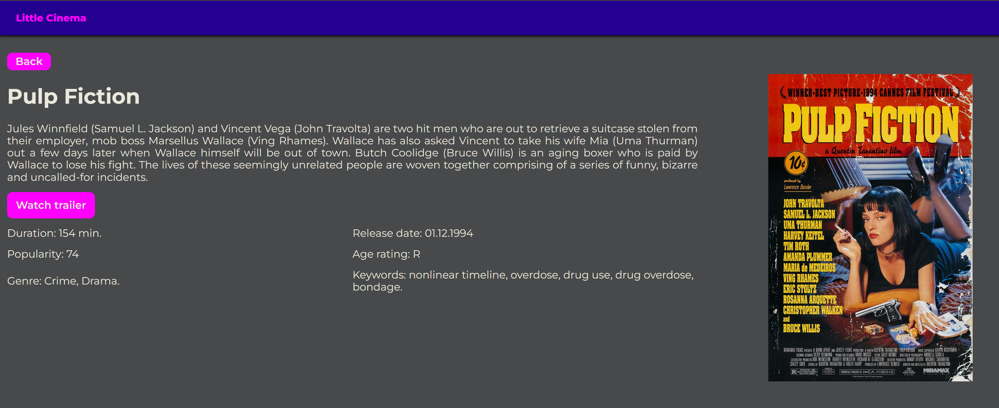

# Little Cinema


### О Проекте

Небольшое практическое задание для одной стажировки.

### Стек технологий

- React
- Vite
- Sass/Scss
- JavaScript (ES6)
- TypeScript
- Node.js
- Express
- Asios
- Eslint



### ⚙️ Как запустить приложение локально

1. Установите необходимые зависимости в репозиториях client и server:

```
npm install
```

2. Создайте файлы .env в папках client и server и заполните на основании .env_example.

3. Запустите сервера в каталогах client и server:

```
npm run dev
```

4. Откройте необходимую страницу в браузере.